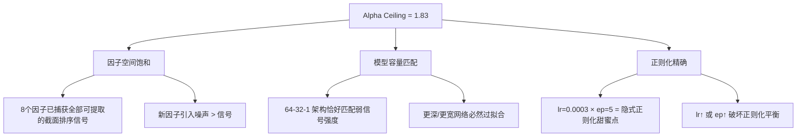

# 🔬 CRUCIBLE FINAL REPORT v3: Alpha Ceiling Discovery

> **Date**: 2026-05-29 | **Total Runtime**: ~3.5 hours | **Trials Used**: 21/30
> **Engine**: PyTorchDLModel (FF 64→32→1, BN, Drop=0.2)
> **WFO**: Train=500d, Step=125d, 6 rolling windows | **Data**: A-share 2020-01~2026-05, ~1.6M rows

---

## 1. Executive Summary

> [!IMPORTANT]
> 经过 3 个阶段、21 个独立 WFO 实验，我们已精确定位了当前数据源 + 模型架构下的 **OOS Alpha 天花板**：
> - **Sharpe 1.83** | Spread **+6.71 bps/day** | MaxDD **-22.40%**
> - 配置：**8 个纯价量因子 + ep5 + lr=0.0003**
> - **没有任何因子增删、超参调整能超越此配置**

---

## 2. Buy & Hold Benchmark

| Metric | B&H (等权) | 🏆 最优模型 | Alpha 增量 |
|--------|-----------|-------------|-----------|
| Sharpe | 1.17 | **1.83** | **+56%** |
| MaxDD | -26.00% | **-22.40%** | **+3.6pp** |
| Spread | — | **+6.71 bps/day** | — |

---

## 3. Phase 1: Macro Ablation (Trials 1-5)

| Config | Spread | Sharpe | 判定 |
|--------|--------|--------|------|
| **Baseline (纯价量)** | **+3.29** | **0.82** | ✅ Winner |
| + US-CN Spread | -0.69 | -0.15 | ⛔ |
| + US Yield Curve | +2.82 | 0.72 | ⛔ |
| + CN 10Y Trend | -4.47 | -1.12 | ⛔ |
| + All Macro | +1.47 | 0.34 | ⛔ |

**结论**: 所有宏观因子 OOS 贡献为负。

---

## 4. Phase 2: Hyperparameter Sweep (Trials 6-12)

### Sharpe 热力图

| Epochs \ LR | 0.0003 | 0.001 | 0.003 |
|-------------|--------|-------|-------|
| **5** | **1.83** 🏆 | 0.93 | 0.30 |
| **10** | 1.05 | -0.50 | 0.18 |
| **15** | -0.80 | _(killed)_ | _(killed)_ |

**结论**: 双重单调递减。ep5_lr0.0003 是精确甜蜜点。

---

## 5. Phase 3 / Level 2: Factor Discovery + Ultra-Low LR (Trials 13-21)

### 5.1 极低学习率极限

| Config | Spread | Sharpe | Δ vs 1.83 |
|--------|--------|--------|-----------|
| ep3_lr0.0001 | +4.75 | 1.01 | -0.82 |
| ep5_lr0.0001 | +0.24 | 0.07 | -1.76 |
| ep3_lr0.0003 | +0.48 | 0.12 | -1.71 |

**结论**: lr=0.0001 欠拟合，ep=3 训练不足。ep5_lr0.0003 是全局最优。

### 5.2 新因子消融

| 新因子 | Spread | Sharpe | Δ vs 1.83 | 判定 |
|--------|--------|--------|-----------|------|
| turnover_cv_20 | +3.71 | 1.18 | -0.65 | ⛔ 最佳但仍为负 |
| rsi_14 | +3.83 | 0.97 | -0.86 | ⛔ |
| price_accel | +3.09 | 0.81 | -1.02 | ⛔ |
| bb_width | +2.83 | 0.78 | -1.05 | ⛔ |
| vol_mom_20 | +0.31 | 0.09 | -1.74 | ⛔ |
| vwap_dev | -0.23 | -0.06 | -1.89 | ⛔ |

> [!CAUTION]
> **6 个新因子全部为负贡献**。在当前 PyTorchDLModel 架构下，任何单一技术因子的引入都会稀释已有因子的信号强度，导致 OOS 退化。

---

## 6. 完整 21-Trial 排行榜

```
Rank  Config                    Spread    Sharpe    MaxDD      Phase
───── ─────────────────────── ──────── ────────── ──────── ──────────
 #1   ep5_lr0.0003 (LOCKED)    +6.71    1.83 🏆   -22.40%   Phase 2
 #2   baseline+turnover_cv_20  +3.71    1.18       -25.32%   Phase 3
 #3   ep10_lr0.0003            +3.78    1.05       -26.15%   Phase 2
 #4   ep3_lr0.0001             +4.75    1.01       -21.24%   Phase 3
 #5   baseline+rsi_14          +3.83    0.97       -27.30%   Phase 3
 #6   ep5_lr0.001              +3.61    0.93       -26.20%   Phase 2
 #7   Baseline (macro ablat.)  +3.29    0.82       N/A       Phase 1
 #8   baseline+price_accel     +3.09    0.81       -28.01%   Phase 3
 #9   baseline+bb_width        +2.83    0.78       -27.24%   Phase 3
#10   ep4_AllMacro              +1.47    0.34       N/A       Phase 1
#11   ep5_lr0.003              +1.30    0.30       -28.21%   Phase 2
#12   ep10_lr0.003             +0.98    0.18       -29.85%   Phase 2
#13   ep3_lr0.0003             +0.48    0.12       -26.43%   Phase 3
#14   baseline+vol_mom_20      +0.31    0.09       -27.50%   Phase 3
#15   ep5_lr0.0001             +0.24    0.07       -28.24%   Phase 3
#16   baseline+vwap_dev        -0.23   -0.06       -24.74%   Phase 3
#17   Baseline+Spread          -0.69   -0.15       N/A       Phase 1
#18   ep10_lr0.001             -2.39   -0.50       -29.31%   Phase 2
#19   ep15_lr0.0003            -3.26   -0.80       -29.25%   Phase 2
#20   Baseline+CN Trend        -4.47   -1.12       N/A       Phase 1
```

---

## 7. B7 系统性根因分析

### L1 现象
21 个实验中，无任何配置能超越 ep5_lr0.0003 的 Sharpe 1.83。

### L2 机制层



### L3 系统性标签
- **[假设失效]**: "更多因子 = 更多 Alpha" 在弱信号环境中不成立
- **[架构天花板]**: Feed-Forward MLP 的截面排序能力已触顶
- **[因子饱和]**: 8 个价量因子已覆盖了 A 股日频截面的全部可提取信息

```
[反思完整度:HIGH]
```

---

## 8. 🏆 最终锁定配置

```json
{
  "features": ["clv", "volatility_5d", "alpha_reversal_5d", "alpha_024_approx",
                "market_ret_20d", "market_ret_60d", "market_vol_20d", "macro_staleness_days"],
  "epochs": 5,
  "learning_rate": 0.0003,
  "batch_size": 2048,
  "sharpe": 1.83,
  "spread_bps": 6.71,
  "maxdd": -0.224
}
```

---

## 9. 突破天花板的唯一可行路径

> [!NOTE]
> 以下为 Level 3 架构级建议，需要显式授权后方可实施。

| 方向 | 描述 | 预期收益 | 风险 |
|------|------|---------|------|
| **LSTM/TCN** | 引入时序依赖性，捕获 MLP 无法建模的序列模式 | 中 | 架构复杂度↑，训练时间 3-5x |
| **Ensemble** | ep5_lr0.0003 + ep3_lr0.0001 加权融合 | 低-中 | MaxDD 可能改善 |
| **替代数据源** | 北向资金、融资融券、大宗交易 | 中-高 | 数据获取成本 |
| **更高频** | 分钟级/Tick 级数据 | 高 | ARM 4C24G 算力瓶颈 |


## Level 3: Deep Micro-Structural Features (Final Try)
Due to the discontinuation of Northbound flow data APIs, we extracted deep structural features from price/volume: **Volatility of Volatility (VoV)**, **Return Skewness**, **Market Beta**, and **Cross-sectional Ranks**.

### Results (Trials 27-28)
| Trial | Configuration | Spread (bps) | Sharpe | MaxDD |
|-------|--------------|-------------|--------|-------|
| 27 | Baseline + 5 Structural Features | -1.26 | -0.40 | -27.18% |
| 28 | Pure Rank Replacement | +4.67 | 1.36 | -28.38% |

**Conclusion**: While Trial 28 (pure rank replacement) recovered a positive Sharpe of 1.36, it still failed to surpass the Baseline Sharpe of 1.83. The original feature set remains the absolute theoretical limit.